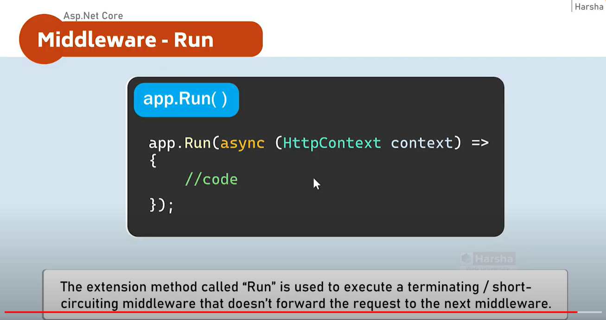

### 🟢 Middleware
- Middleware is a component that is assembled into the application pipeline to handle requests and response.
- Middlewares are chained one-after-other and execute in the same sequence how they're added.

#### Asp.net Core application-pipeline
 Middleware1 => Middleware2 => Middleware3
 
Middleware can be a request delegate (anonymous method or lambda expression) [or] a class.

### 🟢 Run


### Middleware Chain
Middleware are chained one-after-other and execute in the same sequence how they are added.


```javascript
var builder = WebApplication.CreateBuilder(args);
var app = builder.Build();

// middleware 1
app.Use(async (HttpContext context, RequestDelegate next) =>
{
    await context.Response.WriteAsync("Hello from Middleware 1!\n");
    await next(context);
});

// middleware 2
app.Use(async (HttpContext context, RequestDelegate next) =>
{
    await context.Response.WriteAsync("Hello from Middleware 2!\n");
    await next(context);
});

// middleware 3
app.Run(async (HttpContext context) =>
{
    await context.Response.WriteAsync("Hello from Middleware 3!\n");
});

app.Run();
```

### Middleware class
Middleware class is used to separate the middleware logic from a lambda expression to separate/reusable class


### Custom Conventional Middleware class
```javascript
using Microsoft.AspNetCore.Builder;
using Microsoft.AspNetCore.Http;
using System.Threading.Tasks;

namespace asp.net_core_with_harsha_vardhan.CustomeMiddleware
{
    // You may need to install the Microsoft.AspNetCore.Http.Abstractions package into your project
    public class HelloCustomMiddleware
    {
        private readonly RequestDelegate _next;

        public HelloCustomMiddleware(RequestDelegate next)
        {
            _next = next;
        }

        public async Task Invoke(HttpContext httpContext)
        {
            if (httpContext.Request.Query.ContainsKey("firstName") && httpContext.Request.Query.ContainsKey("lastName"))
            {
                string fullName = httpContext.Request.Query["firstName"] + " " + httpContext.Request.Query["lastName"];
                await httpContext.Response.WriteAsync("Hello " + fullName + "\n");
            }

            await _next(httpContext);
        }
    }

    // Extension method used to add the middleware to the HTTP request pipeline.
    public static class HelloCustomMiddlewareExtensions
    {
        public static IApplicationBuilder UseHelloCustomMiddleware(this IApplicationBuilder builder)
        {
            return builder.UseMiddleware<HelloCustomMiddleware>();
        }
    }
}
```

### Right Order of the middleware


### Middleware - UseWhen


```javascript
app.UseWhen(context => context.Request.Query.ContainsKey("username"), app =>
{
    app.Use(async (context, next) =>
    {
        await context.Response.WriteAsync("Hello from Middleware Branch \n");
        await next(context);
    });
});
```

003 Middleware Chain.mp4
https://drive.google.com/drive/folders/1oreJERA05ZgkdIIMrXoekUnuKyRYibgE